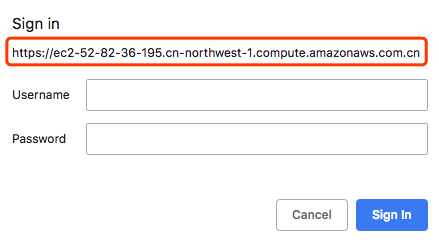

# c9-ide

This project aims to provide a containerized Cloud9 IDE environment on top of [Cloud9 Core](https://github.com/c9/core) and help you bring up a production-ready Cloud9 IDE environment in on-premise environment or other regions which AWS Cloud9 is not available(e.g. AWS China Ningxia and Beijing regions)


# Features

- [x] Everything in a single Docker container. A single `make run` or `docker run` and you are ready to go.
- [x] Shipped with [Caddy](https://caddyserver.com/) as the reverse proxy with the automatic HTTPS capabilities. All traffic goes through SSL/TLS in transit and redirects HTTP to HTTPS.
- [x] Shipped with basic authentication(user/pass) support. 


# Running in AWS China

1. Launch an EC2 instance in public subnet and enabled the public IP address. Make sure the security group has `HTTP`(tcp80) and `HTTPS`(tcp443) wide open(`0.0.0.0/0`). Don't worry, we will restrict the ACL later.

2. Configure the DNS resolution and map your domain name to this public IP address. For example, `c9-zhy3.pahud.net` resolves to `your.ec2.publicIp.address`. You can configure it in Route53 or any other DNS resolver that can resolve your domain.

   ```
   $ nslookup c9-zhy3.pahud.net
   Server:		192.168.31.1
   Address:	192.168.31.1#53
   
   Non-authoritative answer:
   Name:	c9-zhy3.pahud.net
   Address: 52.82.44.160 
   ```

   (In this case, `52.82.44.160` is your EC2 instance public IP)

3. `SSH` into this EC2 instance and install `docker` , `make` and `git` . In Amazon Linux 2 LTS:

   ```
   $ sudo yum install -y docker make git
   $ sudo service docker restart
   $ sudo service docker status (should see active (running))
   ```

   clone the repo

   ```
   $ git clone https://github.com/pahud/c9-ide.git
   $ cd c9-ide
   // sudo as root
   $ sudo -s
   ```

   

   ```
   [root@ip-172-31-37-66 c9-ide]# DOMAIN=c9-zhy3.pahud.net EMAIL=pahud@qq.com MYUSERNAME=changeme MYPASSWORD=changeme make run
   Unable to find image 'pahud/c9-ide:latest' locally
   latest: Pulling from pahud/c9-ide
   a44d943737e8: Pull complete 
   9ad978dcc159: Pull complete 
   fb80c844a047: Pull complete 
   0088efcf6bbe: Pull complete 
   194b3f5ec73b: Pull complete 
   530ba99823b7: Pull complete 
   cdd62414ae71: Pull complete 
   995e80b09714: Pull complete 
   6388f650d1cc: Pull complete 
   9b1318baaffc: Pull complete 
   cd73b561e887: Pull complete 
   3a2f1e1603b9: Pull complete 
   413d808a0258: Pull complete 
   Digest: sha256:7eb69ee416117547f8ceaa6043ecfa85f09838646612110b55700fa55bdebdde
   Status: Downloaded newer image for pahud/c9-ide:latest
   c2822490008c4294f631d03265a3b29d4e6a20b24f60be6b6746e9791ec4e625
   ```

   tail the log

   ```
   [root@ip-172-31-37-66 c9-ide]# make logtail
   Activating privacy features... 2019/01/30 10:09:43 [INFO] acme: Registering account for pahud@qq.com
   2019/01/30 10:09:44 [INFO] [c9-zhy3.pahud.net] acme: Obtaining bundled SAN certificate
   2019/01/30 10:09:44 [INFO] [c9-zhy3.pahud.net] AuthURL: https://acme-v02.api.letsencrypt.org/acme/authz/B5b-VbjJgs3lX89zNdReTKXTvYfIn4-i5ReAzXErahY
   2019/01/30 10:09:44 [INFO] [c9-zhy3.pahud.net] acme: use tls-alpn-01 solver
   2019/01/30 10:09:44 [INFO] [c9-zhy3.pahud.net] acme: Trying to solve TLS-ALPN-01
   2019/01/30 10:09:51 [INFO] [c9-zhy3.pahud.net] The server validated our request
   2019/01/30 10:09:51 [INFO] [c9-zhy3.pahud.net] acme: Validations succeeded; requesting certificates
   2019/01/30 10:09:53 [INFO] [c9-zhy3.pahud.net] Server responded with a certificate.
   done.
   https://c9-zhy3.pahud.net
   2019/01/30 10:09:57 https://c9-zhy3.pahud.net
   http://c9-zhy3.pahud.net
   2019/01/30 10:09:57 http://c9-zhy3.pahud.net
   WARNING: File descriptor limit 1024 is too low for production servers. At least 8192 is recommended. Fix with `ulimit -n 8192`.
   ```

   open your browser to **http://<YOUR_DOMAIN>**

   You will immediately see a pop-up window with **https://** as the scheme, indicating all trafic is SSL/TLS encrypted in transit. Enter your `MYUSERNAME` and `MYPASSWORD` you previously passed in the `make` command and you will see the Cloud9 welcome page.

   


# Clean up

just `make clear` and the running docker `c9-ide` container will be removed immediately.

```
# make clear
c9-ide
# docker ps
CONTAINER ID        IMAGE               COMMAND             CREATED             STATUS              PORTS               NAMES
# 
```


# Security Concern

1. make sure to update the security group of this EC2 instance and allow your original IP only to reduce the attack surface. If possible, disable all `HTTP` trafic and leave `HTTPS` only.
2. don't use the default `MYUSERNAME` and `MYPASSWORD`, which is defined in the `Makefile`


